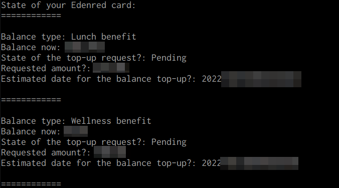

# Edenchecker

This is a simple Python project, which can get you the balance of your Edenred cards, without using the web application or the mobile applications. It does not do anything else.

## Usage and configuration

To run this, you need two environment variables, which are:

- EDENRED_USERNAME - Your Edenred username
- EDENRED_PASSWORD - Your Edenred password

Remember to set the variables correctly in case your password has characters that break variables.

After the variables are in place, you can run the utility from the command line.

## Compability

This works at the moment, at least for the Edenred Duo -type cards. Compability with other cards, benefits and so on is fully unknown. It is also not known if this works with anything else than the Finnish Edenred Duo cards.

## Todo

- Better error handling
- More translations for response codes

## How it works?

This does not differ at all from what happens during the normal browser login to the Edenred website. The whole project is based on HTTP requests which can be seen inside the Network -tab of the browser developer tools.

A session receives authentication cookies after the login, after which the balance is looked up and shown for each 'card'.

## Sample

This is how it looks like when you execute the edenchecker.

